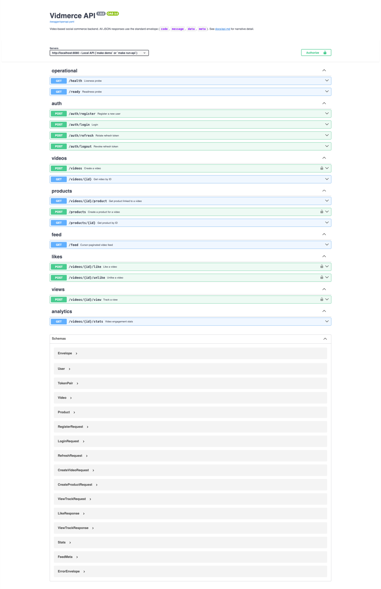
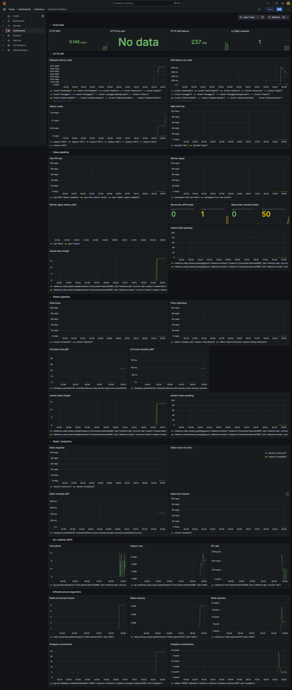
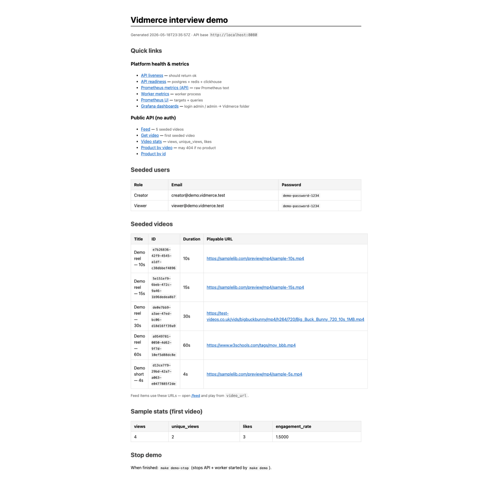

# Vidmerce

A scalable backend for a video-based social commerce platform. Written in Go.

Includes the endpoints from the brief — auth, video/reel CRUD, cursor-paginated
feed, async likes with exact counts, spam-protected view tracking, product
layer, and the analytics bonus — plus the production-grade extras you'd expect
in a real system: distributed rate limiting, a pluggable spam-filter pipeline,
a stampede-protected stats endpoint, Postgres + ClickHouse + Redis used for
exactly what each is good at, and a full test pyramid from unit through k6
load tests.

## Documentation

| Document                             | What's in it                                                                 |
|--------------------------------------|------------------------------------------------------------------------------|
| [`docs/architecture.md`](docs/architecture.md) | Component map, per-pipeline data-flow diagrams, request lifecycles.    |
| [`docs/trade-offs.md`](docs/trade-offs.md)     | Every meaningful decision with the alternative I rejected and why.     |
| [`docs/edge-cases.md`](docs/edge-cases.md)     | Catalogued edge cases (duplicates, partial failures, races) and the handling. |
| [`docs/security.md`](docs/security.md)         | Threat model, JWT lifecycle, password handling, rate-limit policy.     |
| [`docs/scalability.md`](docs/scalability.md)   | Current bottlenecks at the design level and the concrete next-step plays.    |
| [`docs/api.md`](docs/api.md)                   | REST reference. Endpoints, request/response shapes, status codes.      |
| http://localhost:8080/swagger/                 | Swagger UI (same spec as embedded OpenAPI YAML).                       |
| [`docs/redis-keys.md`](docs/redis-keys.md)     | Catalog of every Redis key, its type, TTL, and purpose.                |
| [`loadtest/README.md`](loadtest/README.md)     | k6 scenarios and what to look for in each one.                         |
| [`docs/observability.md`](docs/observability.md) | Prometheus metrics + Grafana dashboards.                           |

Several docs (especially [`docs/architecture.md`](docs/architecture.md) and
[`docs/observability.md`](docs/observability.md)) include **Mermaid** diagrams.
To preview them in VS Code or Cursor, install a Mermaid extension — for
example [Markdown Preview Mermaid Support](https://marketplace.visualstudio.com/items?itemName=bierner.markdown-mermaid) — then open the file and use **Markdown: Open Preview**
(`Cmd+Shift+V` / `Ctrl+Shift+V`). On GitHub, diagrams render automatically in
the web UI without an extension.

## Stack at a glance

| Concern                       | Choice                                  | Why                                                                                                  |
|-------------------------------|-----------------------------------------|------------------------------------------------------------------------------------------------------|
| HTTP                          | Gin                                     | Mature ecosystem, fast, idiomatic Go middlewares.                                                    |
| OLTP store                    | PostgreSQL 16                           | Strong consistency for users / videos / products / likes edges.                                      |
| Analytical store              | ClickHouse 24.3                         | Columnar, MergeTree pre-aggregates → cheap "views in last N days" reads on a firehose of events.     |
| Cache + streams + rate limit  | Redis Stack 7 (RedisBloom)              | Caches, streams, rate limits, locks, and Bloom filters for fast uniqueness checks before Postgres. |
| Auth                          | JWT (HS256) access + opaque refresh     | Stateless access, revocable refresh stored in Redis.                                                 |
| Async transport               | Redis Streams + consumer groups         | One-binary install, at-least-once delivery, replayable, good enough up to ~50k events/sec.           |
| Migrations                    | golang-migrate                          | Plain SQL, dirty-state detection, separate Postgres + ClickHouse trees.                              |
| Tests                         | go test + testcontainers-go + k6        | Unit → integration → load.                                                                           |

## Quickstart

Requires Go 1.25+ (`.go-version` is pinned), Docker, and `make`.

### Run the project (demo)

Install CLI helpers once (Postgres/ClickHouse `migrate` + `golangci-lint`).
Migrations still work without this step — `make migrate-all` falls back to a
Docker image — but local `migrate` is faster and matches CI:

```bash
make tools
make demo
# Open the HTML report printed at the end (file://.../.demo/report.html)
```

`make demo` copies `.env.example` → `.env` if needed, starts Docker (Postgres,
Redis, ClickHouse, Prometheus, Grafana), migrates both stores, runs API +
worker, seeds traffic for Grafana, and writes `.demo/report.html`.

| URL | What to check |
|-----|----------------|
| `.demo/report.html` | All links in one page |
| http://localhost:8080/swagger/ | Interactive OpenAPI (Swagger UI) |
| http://localhost:8080/feed?limit=10 | 5 seeded videos |
| http://localhost:8080/ready | Postgres + Redis + ClickHouse up |
| http://localhost:3000 | Grafana (admin / admin) → Vidmerce dashboards |
| http://localhost:9090 | Prometheus targets |

Demo logins: `creator@demo.vidmerce.test` / `viewer@demo.vidmerce.test` — password `demo-password-1234`.

The seed script drives likes, views, rate limits, filter rejections, ClickHouse batches, and (after a deliberate counter drift) the like reconciler so Grafana panels are not empty. Stats URLs in the report match the videos created in that run — older bookmarked IDs return 404/500 after a fresh migrate.

When finished: `make demo-stop` (API + worker). `make down` stops Docker.

## Screenshots

Taken after `make demo`. PNGs are in [`images/`](images/).

### API docs (Swagger UI)

http://localhost:8080/swagger/



### Grafana dashboards

http://localhost:3000 — login `admin` / `admin`, open the **Vidmerce** folder.



### Demo report

`.demo/report.html` (generated by `make demo`).



### Manual setup

```bash
make tools          # once
make up
make migrate-all
make run-api      # terminal 1
make run-worker   # terminal 2
curl -s http://localhost:8080/health
curl -s http://localhost:8080/ready
```

Environment is loaded from `.env` (use `.env.example` as the template).

## Project layout

```
cmd/
    api/        # the HTTP server
    worker/     # the background consumer (likes + views streams, reconciler)
internal/
    auth/       # register, login, JWT issuance, refresh rotation
    video/      # video CRUD + caching + ownership
    product/    # product CRUD + per-video uniqueness
    feed/       # pull (Postgres keyset) and push (Redis ZSET) fetchers
    like/       # async Redis-first like with exact PG counter + drift reconciler
    view/       # filter chain + stream + ClickHouse sink
    stats/      # cached + stampede-protected analytics endpoint
    health/     # liveness / readiness probes
    platform/   # cross-cutting infra: config, logging, db, redis, clickhouse,
                # rate limiting, JWT middleware, cache, response envelope
migrations/
    postgres/   # OLTP schema (users, videos, products, likes, video_stats)
    clickhouse/ # analytics schema (video_views + SummingMergeTree daily roll-up)
tests/
    integration/  # testcontainers-backed end-to-end tests
loadtest/         # k6 scripts (feed / like / view / stats)
docs/             # the docs listed above
```

## Tests

```bash
make test-unit         # everything (~10s)
make test-integration  # full e2e (~60s on first run; pulls 3 images)
make load-bootstrap    # seed N videos for the feed
make load-feed         # GET /feed under ramping load
make load-like         # likes burst
make load-view         # mixed legit / bot / spammer
make load-stats        # 200 VUs hammering one /stats endpoint
```

## Featured design highlights

- **Likes are async with exact counts.** The hot path is one Lua script in
  Redis (atomic SISMEMBER + counter + XADD); the worker carries the change
  to Postgres in a single CTE that updates both `likes` and
  `video_stats.likes_count` atomically. A periodic reconciler tripwires drift.
  See [`docs/architecture.md#likes`](docs/architecture.md#likes-async-with-exact-postgres-count).
- **Views: total vs unique, duration-aware.** Replays count as total views;
  unique views are once per `VIEW_UNIQUE_TTL` per viewer+video. The edge
  chain enforces watch ≥⅓ of length and a cap of ~`60/duration_sec`/min
  (Redis `video:{id}:dur` only — no Postgres on `/view`). The worker batches
  into ClickHouse; `video_views_daily` exposes `views` and `unique_views`.
- **Feed has two modes** (`FEED_MODE=pull|push`). Pull = Postgres keyset
  pagination. Push = Redis ZSET fan-out cache. Same handler, same response
  shape, same cursor. Compare them side-by-side with `make load-feed`.
- **`GET /videos/:id/stats` has three layers of stampede protection** —
  cache → in-process singleflight → distributed Redis lock with a Lua
  compare-and-delete unlock. Designed for 200+ concurrent requests on one
  video to result in **one** backend query per `STATS_CACHE_TTL` window.
