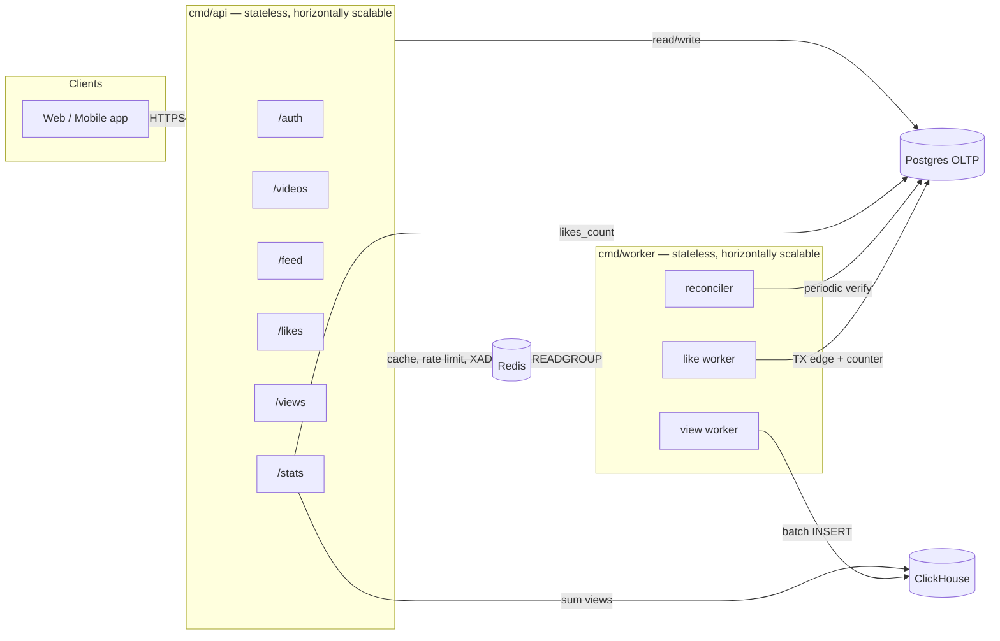
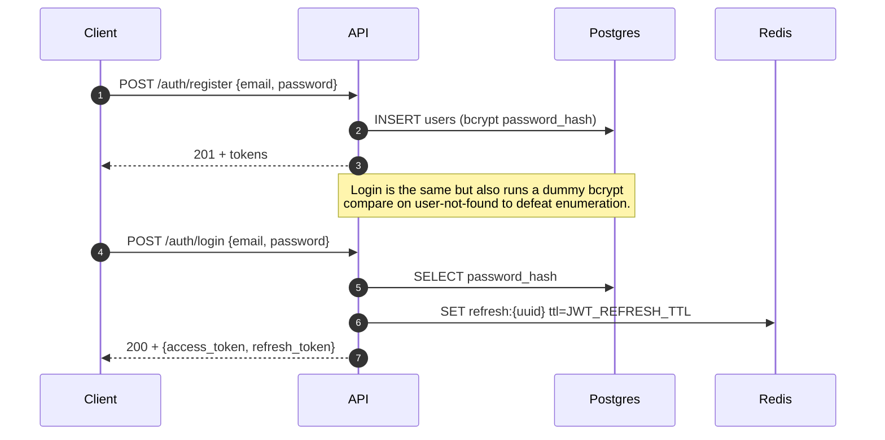
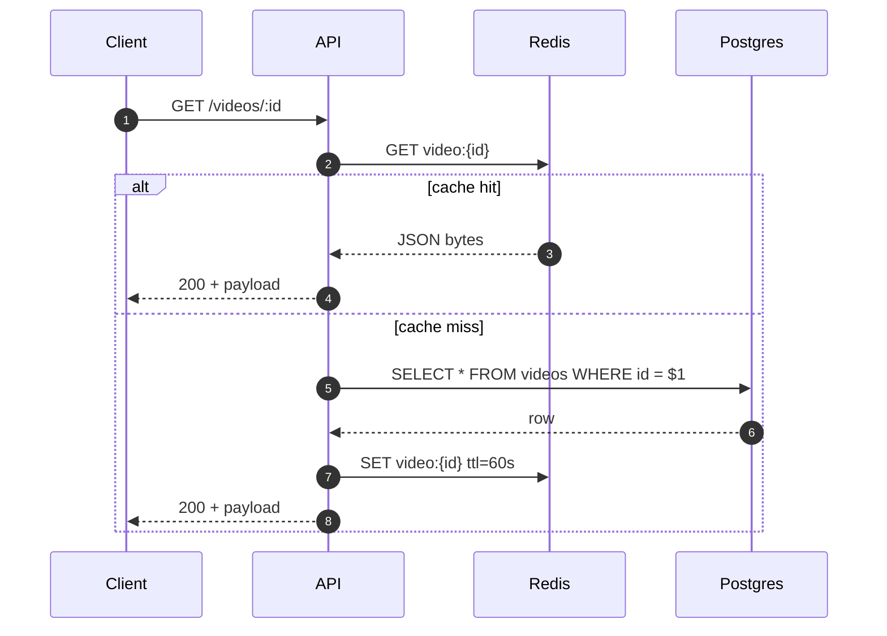
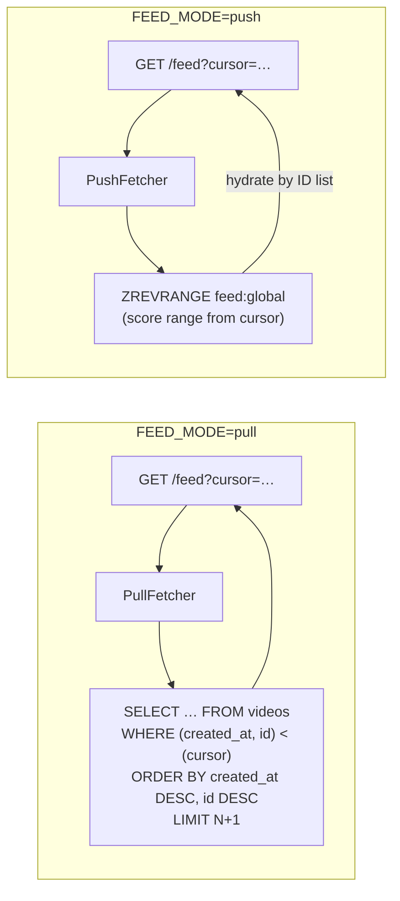
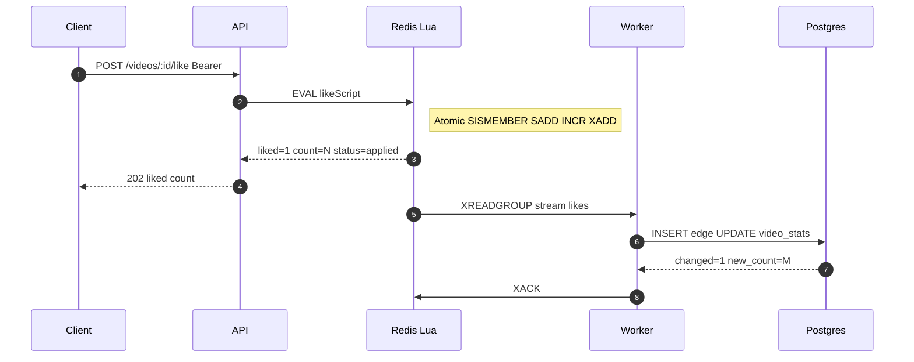
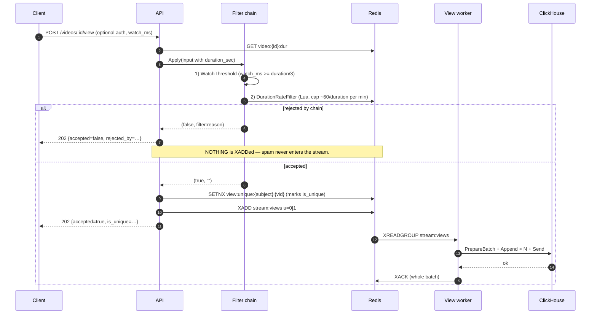
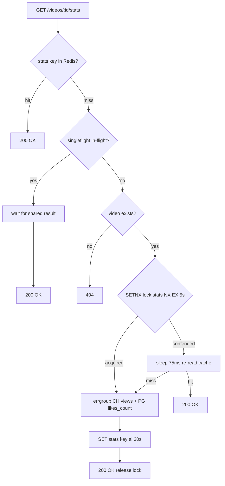
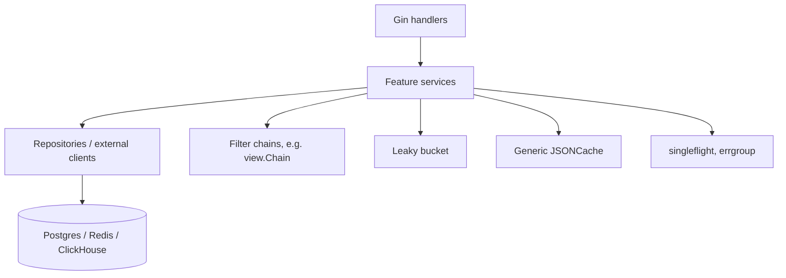

# Architecture

This document describes how the pieces fit together at runtime. For the
*reasoning* behind each choice, see [`trade-offs.md`](trade-offs.md).

## System overview

Two binaries, three stateful backends, one Redis tier doing double duty as
cache + transport + rate-limit state.



### Why two binaries

`cmd/api` serves traffic; `cmd/worker` drains background streams and runs
periodic jobs. Splitting them means we can scale each one independently:
API replicas track read traffic, worker replicas track write throughput.
They share configuration and connect to the same backends, so deploying
either as the other is a one-flag change.

### Why three datastores

| Workload                              | Best fit       | Used for                                                |
|---------------------------------------|----------------|---------------------------------------------------------|
| Strongly consistent point reads       | **Postgres**   | Users, videos, products, like edges, exact like counts. |
| High-write, time-series aggregations  | **ClickHouse** | Raw view events + pre-aggregated daily roll-up.         |
| Sub-millisecond shared state          | **Redis**      | Caches, atomic Lua counters, streams, locks, buckets.   |

Using one database for all three workloads is the most common scalability
failure mode in greenfield social apps. We pay the cost of running three
backends up front to dodge that.

## Request lifecycle

### Auth



Access tokens are HS256 JWTs (`internal/platform/jwt`). Refresh tokens are
opaque UUIDs stored in Redis under `refresh:{token_id}` so logout / revoke is
just a `DEL`. Logging out one session does not invalidate other sessions
(per-user index in `refresh:user:{uid}` would back a "log out everywhere"
feature if added later).

### Videos and products

CRUD with read-through caching. Both feature services depend on the same
generic `cache.JSONCache[T]` in `internal/platform/cache`.



Writes (`POST /videos`, `POST /products`) require `Bearer` auth, validate
input, persist to Postgres, and **pre-warm** the cache with the just-created
row — because the very next request after a create is almost always a read
of that resource.

### Feed (dual mode)



**Pull** is Postgres keyset pagination — index-scan on
`(created_at DESC, id DESC)`, `LIMIT N+1` to detect "more pages". O(log n)
seek cost, no offset math, page size independent of dataset size.

**Push** maintains a Redis sorted set `feed:global` with score
`= created_at_unix`. Adds happen via `WithOnCreate` on the video service.
Reads are `ZREVRANGEBYSCORE` then `FindByIDs` to hydrate, with the cache
checked first. Capped at `FEED_PUSH_ZSET_CAP` (default 1000); older entries
fall off naturally.

Both modes use the *same* cursor format (`base64(JSON{created_at, id})`) so
clients don't care which is active.

### Likes (async with exact Postgres count)



**Why this shape:**

- The hot path is a single Lua call. SISMEMBER + SADD + INCR + XADD in one
  atomic step means duplicate likes are no-ops, the counter is consistent
  with the set membership, and the event is durable on the stream by the
  time we return 202 — no client-visible latency from Postgres.
- The Postgres update is a single CTE (`INSERT ON CONFLICT DO NOTHING` +
  `UPDATE video_stats`). Atomic in one transaction; the edge and the
  counter cannot diverge.
- The worker only XACKs on apply success. Crash mid-batch → entry stays in
  the PEL → redelivered. Because the SQL is idempotent (`ON CONFLICT DO
  NOTHING`, `DELETE WHERE EXISTS`), at-least-once delivery is safe.
- A periodic **reconciler** scans `video_stats` and verifies
  `likes_count == COUNT(*) FROM likes`. Under correct code it always finds
  zero drift; if it ever does find drift, it both fixes it and logs at
  ERROR (your alerting pipeline picks that up).

### Views (filter chain → stream → ClickHouse)

Total views and unique views are **separate metrics**:

- **Total views** — every accepted beacon counts (replays allowed), subject
  to watch threshold and a physics-based rate cap.
- **Unique views** — at most one per `(viewer, video)` per `VIEW_UNIQUE_TTL`
  window (`is_unique=1` in ClickHouse; replays write `is_unique=0`).

Video length is read from Redis `video:{id}:dur` (written at `POST /videos`
create). **`POST /view` never queries Postgres.**



**Rules (defaults):**

| Rule | Value |
|------|--------|
| Min watch | `watch_ms` ≥ **⅓ × duration_sec** (client-reported) |
| Rate cap | **~60 / duration_sec** views/min per (subject, video) |
| Short videos | If `duration_sec` &lt; 5, skip rate cap only |
| Unique window | `VIEW_UNIQUE_TTL` (default 10m) via `view:unique:*` |

Filter order is **cheapest-first** (watch threshold before Lua bucket).
Adding a future filter (IP reputation, ML bot score) is one `view.Filter`
plus a line in `app.go`.

ClickHouse INSERT performance is roughly linear in *statement count*, not
*row count*, so the worker batches by **size OR time** (whichever comes
first). Default: flush at 500 events or 1 second.

### Stats (three-layer stampede defense)



Three layers because each blocks a different failure mode:

| Layer                       | What it stops                                                  |
|-----------------------------|----------------------------------------------------------------|
| Cache                       | The baseline 99% case — most requests never touch a backend.   |
| In-process singleflight     | A burst of N concurrent requests on **one replica** collapses to one compute. |
| Distributed Redis lock      | A burst across **N replicas** collapses to one compute, with a bounded fall-through. |

The lock is released with a Lua `compare-and-delete` so a slow holder can't
delete a successor's lock after their TTL expired (standard Redlock idiom).

## Layering



- **Handlers** map HTTP ↔ services. They own status codes, request parsing,
  and the response envelope; they don't reach into stores.
- **Services** own business logic. They hold cache + repository + downstream
  service interfaces, but never `*pgxpool.Pool` or `*goredis.Client`
  directly. This is what makes them unit-testable with in-memory fakes.
- **Repositories** are the only place SQL / Redis commands live. They
  translate typed Go values to and from store-specific shapes.
- **Composition root** (`internal/platform/app/app.go`) is the *only* place
  concrete types are wired together. New feature packages mount their
  handlers and inject their dependencies here.

## Response envelope

Every JSON response is wrapped in a uniform shape so client SDKs can be
generated mechanically. See `internal/platform/httpx/response.go`.

```json
{
  "code": "ok",
  "message": "",
  "data": { … },
  "meta": { "pagination": { "next_cursor": "…" } }
}
```

`code` is a stable enum (`ok`, `validation_failed`, `unauthenticated`,
`forbidden`, `not_found`, `conflict`, `rate_limited`, `internal`,
`unavailable`). HTTP status maps 1:1 from `code`.
