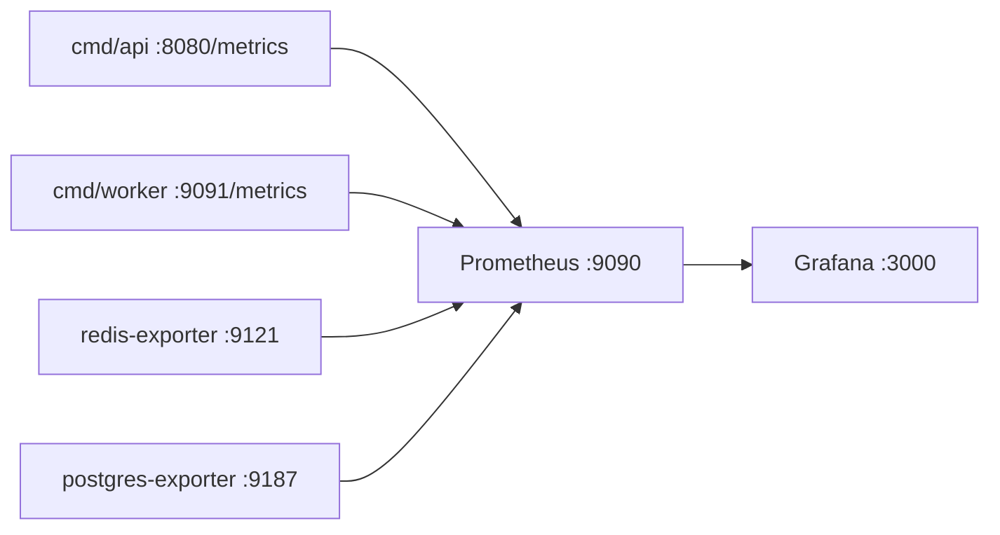

# Observability

Vidmerce exposes **Prometheus** metrics from the API (`:8080/metrics`) and the
worker (`:9091/metrics`). A pre-built **Grafana** dashboard visualises HTTP
traffic, async pipelines, stream backlogs, and infrastructure exporters.

## Quick start

```bash
make up              # starts Prometheus + Grafana + redis/postgres exporters
make migrate-all
make run-api         # terminal 1 — scrapes host.docker.internal:8080
make run-worker      # terminal 2 — scrapes host.docker.internal:9091

# Open Grafana → folder Vidmerce → dashboard "Vidmerce Platform"
open http://localhost:3000    # admin / admin
```

Generate traffic (optional):

```bash
make load-bootstrap
make load-feed
```

## Architecture



Prometheus scrapes the API and worker on the **host** via
`host.docker.internal` because the Go binaries run outside Docker during
local dev. In Kubernetes you would replace those targets with pod service
DNS names.

## Application metrics (`vidmerce_*`)

| Metric | Type | Labels | Meaning |
|--------|------|--------|---------|
| `vidmerce_http_requests_total` | counter | method, route, status | HTTP requests (route = Gin template, not raw URL). |
| `vidmerce_http_request_duration_seconds` | histogram | method, route | Request latency. |
| `vidmerce_http_requests_in_flight` | gauge | — | Concurrent requests. |
| `vidmerce_like_operations_total` | counter | op, status | Redis Lua like/unlike (`applied`, `noop`, `error`). |
| `vidmerce_like_worker_apply_total` | counter | op, changed | Postgres applies from stream. |
| `vidmerce_like_worker_apply_duration_seconds` | histogram | op | Worker Apply() latency. |
| `vidmerce_like_reconciler_drift_total` | counter | — | Drift corrections (should stay 0). |
| `vidmerce_like_reconciler_checked_total` | counter | — | Rows sampled per reconciler pass. |
| `vidmerce_view_track_total` | counter | result | View API (`accepted`, `rejected`, `error`). |
| `vidmerce_view_filter_rejections_total` | counter | filter, reason | Spam chain rejections. |
| `vidmerce_view_worker_batches_total` | counter | — | Successful CH batch flushes. |
| `vidmerce_view_worker_batch_size` | histogram | — | Events per batch. |
| `vidmerce_view_worker_insert_duration_seconds` | histogram | — | ClickHouse insert time. |
| `vidmerce_view_worker_insert_errors_total` | counter | — | Failed CH inserts. |
| `vidmerce_stats_requests_total` | counter | result | Stats endpoint (`cache_hit`, `computed`, `not_found`, `error`). |
| `vidmerce_stats_compute_duration_seconds` | histogram | — | Cold stats compute (CH + PG). |
| `vidmerce_stats_lock_acquire_total` | counter | result | Distributed lock (`acquired`, `contended`, `error`). |
| `vidmerce_rate_limit_hits_total` | counter | bucket | 429s (`login`, `like`). |
| `vidmerce_redis_stream_length` | gauge | stream | XLEN of `stream:likes` / `stream:views`. |
| `vidmerce_redis_stream_pending` | gauge | stream, group | XPENDING count (worker backlog). |

Standard **Go runtime** metrics (`go_*`, `process_*`) are included via the
default Prometheus registry.

## Grafana dashboard

Provisioned automatically from
[`deploy/grafana/dashboards/vidmerce.json`](../deploy/grafana/dashboards/vidmerce.json).

| Section | What to watch |
|---------|----------------|
| **Overview** | RPS, 5xx rate, p95 latency, in-flight. |
| **HTTP API** | Per-route traffic, status codes, rate-limit hits. |
| **Likes pipeline** | API ops vs worker apply, stream pending (backlog alarm). |
| **Views pipeline** | Accept vs reject, filter reasons, CH batch health. |
| **Stats / analytics** | Cache hit ratio, compute p95, lock contention. |
| **Go runtime** | Goroutines, heap, GC (API process). |
| **Infrastructure** | Redis / Postgres exporter metrics. |

### Useful PromQL snippets

```promql
# Cache hit ratio for stats (5m window)
sum(rate(vidmerce_stats_requests_total{result="cache_hit"}[5m]))
/
clamp_min(sum(rate(vidmerce_stats_requests_total[5m])), 1)

# Like stream consumer lag
vidmerce_redis_stream_pending{stream="stream:likes"}

# View spam rejection rate
sum(rate(vidmerce_view_track_total{result="rejected"}[5m]))
/
clamp_min(sum(rate(vidmerce_view_track_total[5m])), 1)
```

## Configuration

| Env var | Default | Description |
|---------|---------|-------------|
| `METRICS_ENABLED` | `true` | Toggle Prometheus instrumentation. |
| `METRICS_PATH` | `/metrics` | API metrics endpoint path. |
| `METRICS_WORKER_PORT` | `9091` | Worker metrics HTTP port. |
| `METRICS_REDIS_POLL_INTERVAL` | `15s` | How often to poll stream XLEN/XPENDING. |

## Files

```
deploy/
  prometheus/prometheus.yml          # scrape targets
  grafana/provisioning/              # datasource + dashboard provider
  grafana/dashboards/vidmerce.json   # main dashboard (41 panels)
internal/platform/metrics/           # instruments + middleware + collector
```

## Production notes

- Run API and worker with `METRICS_ENABLED=true`; scrape both targets from
  Prometheus every 15s.
- Alert on: `vidmerce_redis_stream_pending > 1000` (worker falling behind),
  `vidmerce_like_reconciler_drift_total` increasing, HTTP 5xx rate > 1%.
- Disable metrics in unit tests by setting `metrics.Enabled = false` if you
  need to avoid duplicate registration in specialised test harnesses.
