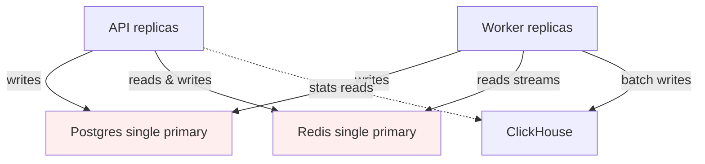

# Scalability

Where the design holds, where it breaks, and what to do about it. Ordered
roughly by traffic level (small → very large).

## What's already horizontal

Stateless by design:

- **API replicas** share nothing. Add replicas behind an L7 LB → linear
  read scaling. Refresh tokens, rate-limit state, and the like/view
  hot-state are in Redis so any replica can serve any request.
- **Worker replicas** join the same Redis consumer group. Each entry is
  delivered to exactly one consumer; adding workers scales the drain rate
  of the streams.

Stateful, scale-up first then scale-out:

- **Postgres** (OLTP core) vertical scale + read replicas first; **CockroachDB**
  is the documented drop-in path when you need multi-AZ survival or horizontal
  SQL without app-level sharding — see [§2](#2-replace-postgres-with-cockroachdb).
  Redis and ClickHouse stay unchanged either way.
- **Redis** single-primary handles ~100k ops/sec on commodity hardware.
  Redis Cluster is the path beyond.
- **ClickHouse** scales horizontally by design — shards + a distributed
  table sit behind the same `Conn`.

## Bottleneck map

Single points (red): Postgres primary (or Cockroach cluster — same role),
Redis primary. Multi-shard (blue): ClickHouse.

## Numbered scaling plays

### 1. Add Postgres read replicas

**Trigger:** read p95 on `GET /feed` (pull mode) > 100ms despite the cache.

**Play:** stand up a streaming replica; route feed-pull and other read-only
queries to it via a separate DSN (`POSTGRES_DSN_READONLY`). The
composition root in `app.go` is the only place that needs to change.

**Stays trivial because:** every repository already takes a `*pgxpool.Pool`,
and the writes that *must* go to the primary are concentrated in the
worker, which we don't move.

### 2. Replace Postgres with CockroachDB

**Trigger:** any of:

- **Multi-AZ / multi-region** — you need the SQL tier to survive zone or
  region loss without manual failover (Patroni, operator gymnastics).
- **Horizontal SQL scale** — the primary is CPU- or disk-bound and read
  replicas are not enough (write-heavy `likes`, large `videos` table, hot
  rows on global counters).
- **Uniform ops model** — you already run Cockroach (or want one
  distributed SQL product) and prefer range-based replication over
  “shard this table in application code.”

**Play:** swap the OLTP store. Cockroach speaks the **Postgres wire
protocol**, so `pgx`, migrations, and repository SQL largely carry over.
Point `POSTGRES_DSN` at the Cockroach SQL proxy / load balancer instead of
a single Postgres host. No change to Redis (streams, Lua, caches, blooms)
or ClickHouse (view analytics) — they solve different problems.

| Layer | Role today | With Cockroach |
|-------|------------|----------------|
| Postgres / Cockroach | Users, videos, products, likes, exact counts | Same schema & queries; distributed ranges |
| Redis | Hot path, rate limits, feed push cache | Unchanged |
| ClickHouse | View events & rollups | Unchanged |

**What you gain:**

- **Multi-AZ by default** — replicas and leader election are built in;
  losing a node or AZ does not require a runbook to promote a replica.
- **Horizontal scale of the SQL tier** — add nodes; Cockroach rebalances
  ranges. Avoids hand-rolled user-id sharding for `likes` until much later.
- **Optional multi-region** — follower reads and region-local leases when
  you outgrow “single region + CDN.”

**What you pay:**

- **Write latency** — distributed consensus per write is higher than a
  single well-tuned Postgres primary on one machine.
- **Ops complexity** — cluster sizing, zone configs, transaction retries
  under contention (like worker CTEs on the same `video_stats` row).
- **Migration work** — test migrations on CRDB, validate `SERIAL`/UUID
  defaults, run integration tests, tune connection pools for multiple
  gateways.

**What does *not* move to Cockroach:**

- View firehose volume → still **ClickHouse** (row store is the wrong tool).
- Sub-millisecond shared state → still **Redis** (rate limits, streams, Lua).

**When Postgres is still enough:** single-region product, moderate QPS,
replicas cover feed-pull reads, like worker keeps up — see [§1](#1-add-postgres-read-replicas).
That is the default in this repo (`docker-compose` uses Postgres for simplicity).

See also [`trade-offs.md`](trade-offs.md) §2 (why SQL is only the OLTP slice)
and [§1](#1-add-postgres-read-replicas) here for the read-replica step
*before* a full Cockroach migration.

### 3. Switch feed to push mode

**Trigger:** "for-you" personalised feed appears in the product roadmap.

**Play:** flip `FEED_MODE=push`. The push fetcher's existing `WithOnCreate`
hook means new videos start fanning out into `feed:global`. To go
personalised, add a per-follower fan-out: when a creator posts, the worker
inserts the video ID into the ZSETs of every active follower (capped at
N).

**Cost:** write amplification = O(followers). Mitigate by capping at active
followers (last-30-days), and by switching to pull for users who follow >
some threshold (e.g. celebrities) — covered in the "hybrid push/pull"
pattern in the trade-offs doc.

### 4. Partition the like stream by hash(user_id)

**Trigger:** the like worker can't drain `stream:likes` fast enough under
peak (queue backlog grows monotonically).

**Play:** publish to one of N streams (`stream:likes:0..N-1`) selected by
`hash(user_id) % N`. Each stream has one consumer that owns it
exclusively, preserving per-user order. The consumer-group concept stays
the same; you just have N of them.

**Why N streams instead of N consumers on one stream:** a single Redis
stream with N consumers delivers each entry to *one* consumer
non-deterministically — that breaks per-(user, video) ordering. Partition
by hash to give each user a sticky shard.

### 5. Replace Redis Streams with Kafka

**Trigger:** sustained > 50k events/sec on a single stream, or a need for
multi-region durability.

**Play:** swap the transport. The worker reads via XREADGROUP today; the
sink/repository interfaces don't know that. A Kafka consumer with a
batch-and-commit pattern is roughly the same shape.

**Things that change:**

- Delivery semantics: stays at-least-once, so the idempotent SQL keeps
  working as-is.
- Operational surface: a 5th piece of infra (ZK or KRaft).
- Cost: significantly higher than Redis Streams up to the crossover point
  somewhere around 10–50k events/sec sustained.

### 6. ClickHouse shards

**Trigger:** `video_views_daily` table > 10 TB, or query p95 > 1s.

**Play:** add ClickHouse nodes, create a `Distributed` table over the
shards, route reads through it. Inserts continue to the shards directly
(or through the Distributed table at lower throughput). Our pre-aggregate
already shrinks the table by orders of magnitude vs raw events, so this
trigger is well over a year of operation away in most products.

### 7. Cache layer: Redis → Redis Cluster

**Trigger:** Redis CPU > 80% sustained, OR memory > 60% of host RAM.

**Play:** migrate to Redis Cluster. The blocker is that `EVAL` of a Lua
script must access keys on the same slot. Today:

- `likeScript` touches three keys: `user:{uid}:liked:videos`,
  `video:{vid}:likes`, `stream:likes`. These are on different slots in a
  clustered Redis.

The fix is **hash tags**: wrap the partition key in `{}` so the cluster
hashes only the tag. We'd rename to e.g.
`user:{uid}:liked:videos`, `video:{vid}:likes`, `{likes}stream` — the
script accesses `{uid}` for the user set, `{vid}` for the counter, and a
separate stream. We'd then need to split the stream by partition too (see
#3), so a clustered Redis goes hand-in-hand with stream sharding. Same
amount of work, more capacity headroom.

### 8. Geographic distribution

**Trigger:** users in regions where the round-trip to the primary region
makes the API feel sluggish.

**Play:**

- Static reads (`GET /videos/:id`, `GET /products/:id`, `GET /feed`)
  served from regional read-replicas (Postgres) or **regional followers**
  (Cockroach) with a CDN on top. Cache TTL stays at 60s.
- Writes: single-region primary (Postgres) or **Cockroach multi-region**
  ([§2](#2-replace-postgres-with-cockroachdb)) when you need survivable
  writes in more than one region — still keep likes strongly consistent.
- ClickHouse replicates per-region; a regional API can serve `/stats`
  from the local shard.

### 9. Push notification fan-out (future)

When a new video gets a flood of likes, we may want to push a notification
back to the creator. Today: not implemented. Path: new worker pipeline
that reads `stream:likes`, aggregates per-creator over a window, calls
the push provider. The existing stream is the right transport because the
aggregation can lag by a few seconds — exactly the kind of work where
Redis Streams + a batching worker is the right tool.

## Concrete numbers (rough order of magnitude)

These are *thinking budgets*, not benchmarks. Verify with `make load-*`
on your target hardware.

| Surface                | Per-replica capacity (commodity 4-core VM) | Limit          |
|------------------------|--------------------------------------------|----------------|
| `GET /feed` (cached)   | ~10k QPS                                   | Bound by Redis CPU |
| `GET /feed` (cold)     | ~500 QPS                                   | Bound by Postgres |
| `POST /like|/unlike`   | ~5k QPS                                    | Bound by Redis Lua throughput |
| `POST /view`           | ~5k QPS                                    | Bound by Redis (duration GET + filter Lua + unique SETNX + XADD) |
| `GET /stats` (cached)  | ~10k QPS                                   | Bound by Redis GET |
| `GET /stats` (cold)    | ~50 QPS                                    | Bound by ClickHouse + Postgres in parallel |
| `like worker` (drain)  | ~5k events/sec/consumer                    | Bound by Postgres write rate |
| `view worker` (drain)  | ~50k events/sec/consumer                   | Bound by ClickHouse batch rate, not Redis |

The asymmetry between the like worker (5k/sec) and the view worker
(50k/sec) is **why** likes write exactly to Postgres and views write to
ClickHouse — putting view writes on Postgres would cap us at 5k/sec right
out of the gate.

## What the design intentionally does NOT do

- No multi-master **single-node** Postgres in one AZ forever — when
  multi-AZ or horizontal SQL is required, the documented path is
  [CockroachDB §2](#2-replace-postgres-with-cockroachdb), not bolting
  multi-master onto one Postgres instance.
- No global transactions. We do *not* atomically commit "edge written in
  Postgres + counter updated in Redis". Reconciler heals.
- No exactly-once delivery. At-least-once + idempotent receivers is
  simpler, faster, and equally correct for our workload.
- No event sourcing. Stream is the transport, not the source-of-truth.
  We tested event-sourced like systems in past projects and the
  operational cost is much higher than the alleged auditability benefit.
