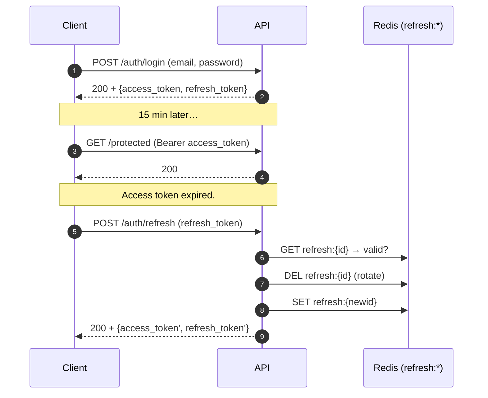

# Security

## Threat model (what we defend against)

| Threat                                       | Mitigation                                                                                         |
|----------------------------------------------|----------------------------------------------------------------------------------------------------|
| Password brute-force on the login endpoint   | Per-IP leaky-bucket rate limiter, fail-closed. Bcrypt cost 12 (configurable).                       |
| User-enumeration via timing on login         | Dummy bcrypt compare on user-not-found so failed-login latency is independent of whether the user exists. |
| Token theft (access)                         | Short TTL (default 15m). No long-lived JWTs.                                                       |
| Token theft (refresh)                        | Opaque UUIDs stored in Redis; rotation on every refresh; revocable by `DEL`.                       |
| Cross-user access via stolen access token    | The token *is* the credential during its TTL window — mitigated by keeping TTL short.              |
| SQL injection                                | pgx parameterised queries everywhere; no string concatenation in SQL.                              |
| Mass like / view abuse                       | Views: watch ≥⅓ duration; duration-based leaky bucket (`60/duration_sec`/min); unique window via `view:unique:*`. Likes: per-(user,video) bucket. |
| Cache poisoning                              | Cached values are typed via `JSONCache[T]`; deserialisation failure logs and treats as miss.       |
| Denial-of-service via expensive analytics    | `GET /stats` cache + singleflight + distributed lock — N concurrent requests → 1 backend query.    |
| Sensitive data leak in logs                  | Structured logging via `log/slog`; we log user IDs but never email, password, or tokens.           |
| Cursor tampering                             | Cursor is unauthenticated but only opens public feed queries — no privilege escalation possible.   |

## Authentication & authorization

**Access tokens (HS256 JWT):**

- Short TTL bounds the impact of theft.
- Signed with `JWT_SECRET` — must be set in production (`config.validate`
  fails to boot if `APP_ENV=production` AND the secret is still the dev
  default).
- We use **HS256** (symmetric) rather than RS256: every service that
  needs to verify a token also has the secret. RS256 is the right call
  when the signer and verifiers are operated by different teams; not the
  case here.

**Refresh tokens:**

- Opaque (just a UUID), not a JWT. Verification is a single `EXISTS` in
  Redis.
- One refresh rotates to a brand-new pair; the old refresh is `DEL`'d. A
  stolen refresh token will fail the second use because the original
  legitimate use already rotated it.
- Storing refresh tokens in Redis gives us O(1) revocation. Logout is a
  `DEL`.

**Authorization:**

- `RequireAuth` middleware (strict): rejects missing/malformed/expired
  bearer tokens with 401.
- `OptionalAuth` middleware: populates user ID *if* the token is valid,
  doesn't reject otherwise — used by `POST /videos/:id/view` so
  anonymous viewers are tracked separately from logged-in ones.
- Resource-level checks: `product.Create` calls `video.AssertOwner` which
  returns 403 if the caller doesn't own the linked video.

## Password handling

- `bcrypt` with `BCRYPT_COST=12` (configurable; cost ≤ 10 rejected at PR
  review).
- Stored as `users.password_hash`; the column is never selected into a
  JSON response — `PublicUser` (the API-side projection) doesn't include
  it.
- Plain-text passwords are accepted only over HTTPS (operator's
  responsibility — this codebase doesn't terminate TLS).

## Rate limiting policy

| Surface              | Bucket key                      | Capacity | Leak                | On infra failure |
|----------------------|---------------------------------|----------|---------------------|------------------|
| `POST /auth/login`   | `bucket:login:{ip}`             | 10       | 10/min              | Fail-closed (503) |
| `POST /videos/:id/view` | `bucket:view:{subject}:{vid}` | `60/duration_sec` | `60/duration_sec` per min (skip if duration &lt; 5s) | Fail-open         |
| `POST /videos/:id/like` etc | `bucket:like:{uid}:{vid}` | 10       | 5/min               | Fail-open         |

Fail-closed for login: under a Redis outage we'd rather refuse logins
briefly than let an attacker grind unlimited attempts through. Fail-open
for views/likes: brief over-counting is acceptable; refusing legitimate
engagement under a Redis hiccup is not.

## Input validation

- All bodies are bound with Gin's `ShouldBindJSON` and re-validated by the
  service layer (defense in depth — services accept input from any caller,
  not just HTTP).
- Email format: simple regex + length cap.
- Password: minimum 8 chars (configurable). We deliberately don't enforce
  character-class rules (NIST guidance: encourages weakness).
- Video URL / image URL: not URL-validated at the API layer (the storage
  layer is responsible). Documented as a tightening opportunity.

## Logging hygiene

`log/slog` is the only logger. Conventions:

- User IDs: yes (UUID — not a privacy concern by itself).
- Emails: never in logs.
- Passwords: never in logs.
- Tokens (access or refresh): never in logs.
- Request IDs: yes (`X-Request-ID` propagated through every middleware so
  errors can be correlated end-to-end).

The `httpx.AccessLog` middleware emits one structured log per request with
method, path, status, duration, and request ID. Bodies are not logged.

## Storage at rest

The OLTP store contains `password_hash` and `email`. In production:

- Disk encryption is operator-managed (LUKS / AWS EBS encryption / etc.).
- Postgres TDE is out of scope for this codebase but compatible.
- Backups must be encrypted before transport (also operator-managed).

The analytical store contains hashes of IPs and UAs — never the
plaintext. Hashes are unsalted SHA-256 truncates: enough to defeat rainbow
tables, weak enough that an attacker with the full table could potentially
guess single IPs. We accept that because the column exists for spam-
grouping, not for confidentiality.

## What's intentionally out of scope

- CSRF protection: we use bearer tokens not cookies; CSRF is a non-issue
  for this transport. If we ever ship a same-origin cookie-based session
  (e.g. a web admin), we'd add CSRF tokens at that layer.
- CORS: configured at the reverse proxy layer in production, not in this
  codebase.
- DDoS at the transport layer: Cloudflare / WAF concern, not API code.
- Audit log: not required by the spec. The structured access log is the
  closest thing — sufficient for incident response in conjunction with a
  log aggregator.
